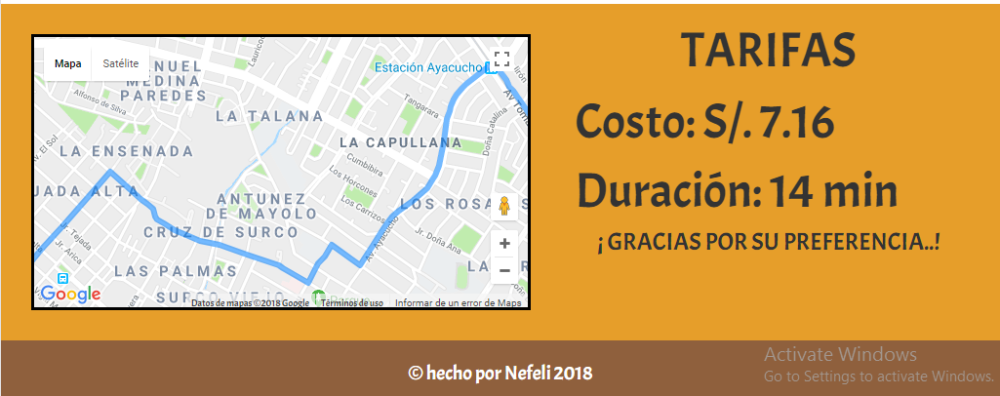

# TAXIMAX

Es un aplicacion donde se podra conocer la Ruta del recorrido que se desea hacer, añadiendo a ello la estimacion del  precio y el tiempo de viaje que realizara el usuario. TRES EN UNA SOLA APLICACION...!TAXIMAX PARA QUE MAS¡ 

## Desarrollado para [Laboratoria](http://laboratoria.la)

## Objetivo:

Realizar un estimador de tarifa de un viaje en Taximax, utilizando la API de Google maps. 

## Herramientas:

+ Google maps API
+ Javascript
+ CSS3
+ HTML5

## Flujo

## Vista desktop de la aplicación web:

_____________________________________________________________________________________________________________________

_____________________________________________________________________________________________________________________
+ La busqueda se de la Ruta se realizara al permitir y cuando el usuario coloque punto de partida e inicio

_____________________________________________________________________________________________________________________

## Vista mobile 

_____________________________________________________________________________________________________________________

_____________________________________________________________________________________________________________________

____________________________________________________________________________________________________________________

## Créditos:

+ Nefeli Joñoruco.

